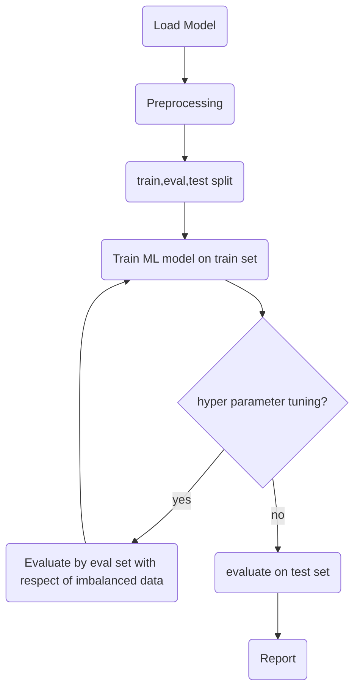

# پیاده‌سازی پروژه یادگیری ماشینی با pyspark
در این پروژه قصد داریم مجموعه دستورات لازم برای انجام یک طبقه‌بندی باینری ساده را در pyspark بحث و بررسی کنیم.

## مجموعه داده

## بارگذاری داده

## پیش‌پردازش

## مهندسی ویژگی

## معیارهای ارزیابی
در این پروژه به علت نامتوازن بودن داده‌های طبقات (imbalanced data) از معیارهای ارزیابی F1(macro), ROC و AUC 
استفاده شده است. برای اطلاعات بیشتر به صفحه [معیارهای ارزیابی](./evaluation_metrics.md) مراجعه کنید

## مرال 
  
  

مراحل انجام در فلوچارت زیر آمده است:
</div

  
### ML Flowchart

